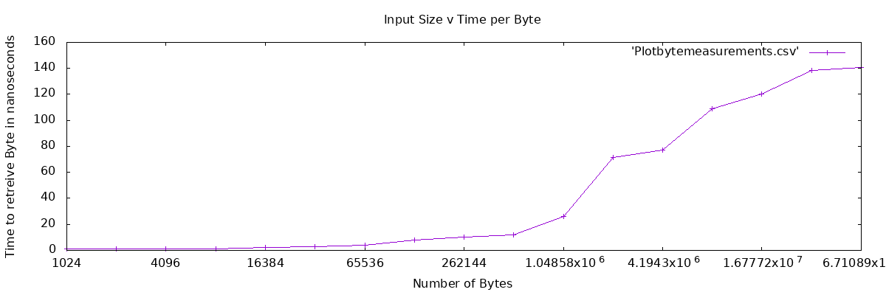

# CSCI389_HW1 Hannah Hellerstein
Homework 01 (Benchmarking the memory hierarchy) for Reed College Computer Systems Course
Part 1: Benchmarking (60%)
NOTE: I did get some help from my tutor, Monica Moniot (specifically, to shift my code s.t. it shifted to a buffer of ints from a buffer of chars.)
☹
Please see [bytesbenchmark.cpp] for actual file implementation.
My logic behind the code was as follows: I needed buffer sizes ranging from 2^10 to 2^26 in order to get a good range. So, I composed everything in one for loop that would contain all of that. I also made a function init_buffer that would initalize avector of ints (our buffer) with unique indecies into itself shuffled randomly such that a section in the buffer pointing to itself would be impossible and that loops would be unlikely. 
I then had two for loops: one for initializing the buffer into caches, the next for actually timing it. The first one was somewhat impractical, existing namely to just access random parts of the buffer such that the optimizer and compiler couldn't just toss the entire buffer.  The second for loop was what would actually be timed: accessing random parts of the buffer using an index, and testing it by the (somewhat arbitrary) testing size to get an estimate of how long accessing a single byte at a given size could take. I then printed out the 'randomByteInt' so the optimizer wouldn't just toss all our work.
I then ran the program 10 times, and then took the minimum results of a given byte size.  Below are the averages, which I note tended to skew a bit high due to some outliers. 
NOTE: It was pointed out that due to vague wording of the assignment, it's possible that 

Bytes:      Time of one byte: 
1024	0.976562
2048	0.976562
4096	1.2207
8192	1.34277
16384	2.38037
32768	2.86865
65536	3.89099
131072	7.85065
262144	10.1891
524288	11.8198
1048576	26.0649
2097152	71.312
4194304	76.8921
8388608	108.69
16777216	120.244
33554432	138.52
67108864	140.623
	
	

Part 2: Graphing (10%)
Produce graph showing the mean latency per memory read (in ns, on the Y-axis) vs. buffer size in KB (on the x-axis). Iterate to make your graph readable and useful. Ask each other for feedback on clarity. You may use any graphing tool you're comfortable with: gnuplot, R, Excel, Google spreadsheets, etc. Your graph should be included and visible from the README.md file.

[Please see meanLatencyPerMemoryRead.png]

Part 3: Analysis (30%)
a)Try to identify the sizes of your CPU's different caches from the graph and explain your reasoning. (Your guesses don't have to be 100% correct if the graph isn't accurate, but your reasoning should be.) If the graph is not monotonous or not a step-function, speculate why that might be.

So, because I have a modern day computer, I will assume I have an L1, L2, and DRAM. I am also going to assume based on the fact that my computer is a mac/the numbers I tended to get, that I my computer has an L3 cache. 
Though it's not the clearest, I woulld say that my graph does seem to have visiblle steps/parts where the time per byte inceases. Namely, there does seem to be notable increases at 16384, 262144, 1048576, 2097152, 8388608, 33554432  bytes. 
Now, I'm gonna hope that my computer doesn't have a measly 16K L1 cache. However, after the 16382 part, the access times never again go below that 1.0 spot. So, I'll guess that my L1 is two steps above it, since 32768 and 65536 don't have that different a runtime. So, L1 has around... 66KB?
As for L2, it of course will be later. Technically the next big jump starts at 262144 and ends before 1048576. But, I doubt my L2 has THAT much space. So, 524288 is the inbetween, so I'd guess L2 would have around 525KB?
As for L3, it again shoulld be larger. If my guesses are correct, it should be WAY larger, by perhaps not-quite an order of (based on my other guesses) 10. 4194304 
is the next closest stop based on that logic, and also makes more sense as everything after that takes VERY long in comparison (an instant leap from 70-ish to 100+-ish nanoseconds) so that implies to me that we'd be out of L3. I don't think my computer has an L4 as those are rare. So, as for guessing the size of L3... 4195K is a good enough guess (the extra bytes might actually be being recorded/used in L2 or L1, I am not sure).

b)Did you get approximately the same performance as these (http://norvig.com/21-days.html#answers) numbers? Explain why or why not.
I'd say approximately things looked accurate. I expected L1 to take less-than/around a nanosecond or two. L2 then wouldn't shock me if was the range of ~3-~11 nanoseconds I had in my recording. DRAM I also suspect to be the cause of that last bit/last few notable big jumps in memory, so that's fine. I'm not sure where L3 fits into this beyond my guess of "somewhere between L2 and DRAM," and since it's not noted on the website above... hopefully it's all good?

c) Look up which specific CPU you have in your test computer (hint: /proc/cpuinfo on Linux) and what its cache sizes are supposed to be (with a search engine if necessary), and compare them to your guesses above in #1.

My CPU is: 2.3 GHz Dual-Core Intel Core i5.
From the linux command lscpu, I got:
L1d cache:           32K
L1i cache:           32K
L2 cache:            256K
L3 cache:            4096K

Now, I'm somewhat confused. You see, I got my numbers here while running it from a VM, which was using one of my two cores (I think). Presuming though I effectively had two layers of L1 (meaning 64K cache size) then my guess for L1 was pretty close! My L2... less so, by around double what the actual amount was.  Similarly with L3, I was off by around 100K, which maybe in the scheme of L3 is not that bad but still amounts to a lot of bytes misplaced.  

